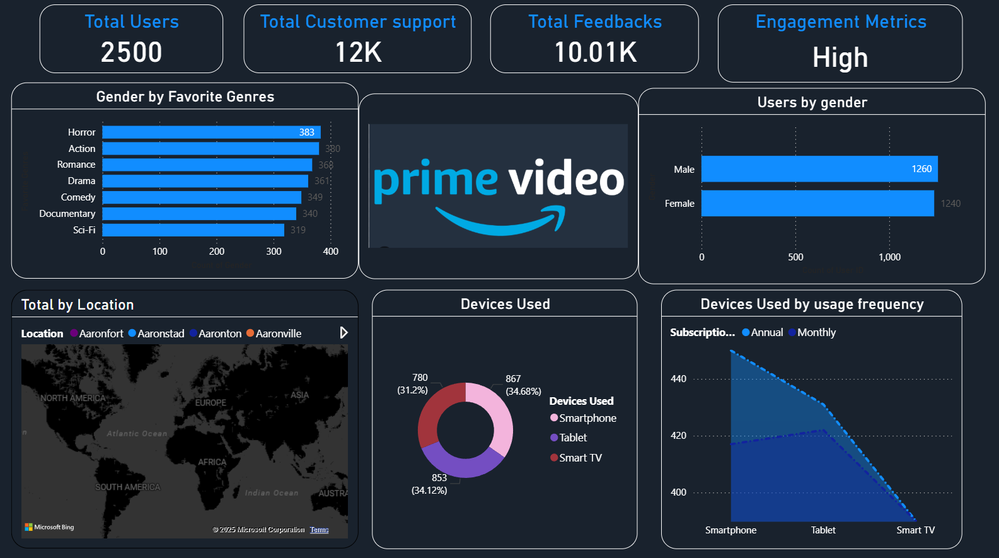

# OTT Platform User Engagement Analytics (Power BI)

## Problem Statement
OTT platforms require data-driven insights into user demographics, content preferences, device usage, and engagement levels to improve customer retention and personalization strategies.

## Objective
- Analyze user behavior and engagement metrics
- Identify gender-based content preferences
- Understand device usage patterns
- Provide actionable insights for business and product teams

## Dataset
- Simulated / anonymized OTT platform user data
- Includes user demographics, content genres, devices, locations, and feedback metrics

## Key KPIs
- Total Users
- Total Customer Support Interactions
- Total Feedbacks
- Overall Engagement Level

## Dashboard Insights
- Gender-wise favorite content genres
- User distribution by gender
- Geographic distribution of users
- Device usage breakdown (Smartphone, Tablet, Smart TV)
- Subscription usage frequency across devices

## Tools & Technologies
- Power BI
- Data Cleaning & Transformation
- Data Modeling
- DAX (where applicable)

## Business Impact
- Helps marketing teams optimize content and campaign strategies
- Assists product teams in understanding device usage behavior
- Supports data-driven decision-making for improving user engagement

## Dashboard Preview

